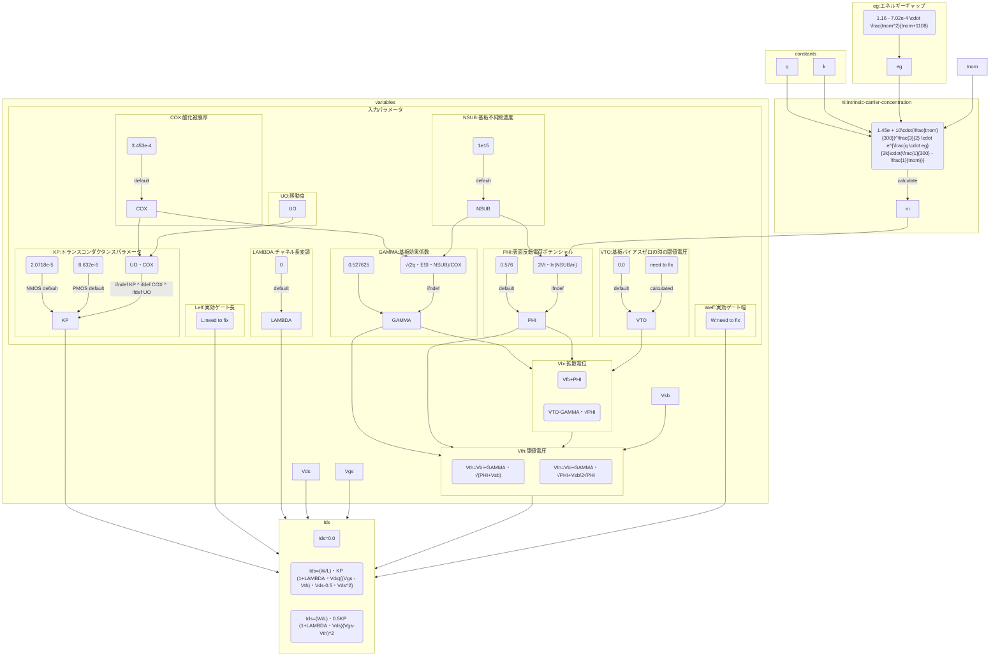

```mermaid
flowchart TB

COX --> UO-COX
COX --> GAMMAifndef
GAMMA --> Vth:閾値電圧
GAMMA --> Vbi:拡散電位
KP --> Ids
L --> Ids
LAMBDA --> Ids
NSUB --> PHIifndef
NSUB --> GAMMAifndef
PHI --> Vth:閾値電圧
PHI --> Vbi:拡散電位
UO --> UO-COX
Vbi:拡散電位 --> Vth:閾値電圧
Vds --> Ids
Vgs --> Ids
Vsb --> Vth:閾値電圧
Vth:閾値電圧 --> Ids
VTO --> Vbi:拡散電位
W --> Ids
ni --> PHIifndef


subgraph Ids
    Ids_cutoff("Ids=0.0")
    Ids_Linear("Ids=(W/L)・KP (1+LAMBDA・Vds){(Vgs - Vth)・Vds-0.5・Vds^2}")
    Ids_Sat("Ids=(W/L)・0.5KP (1+LAMBDA・Vds)(Vgs-Vth)^2")
end
subgraph variables
    direction TB
    Vgs
    Vds
    Vsb
    Vth:閾値電圧
    Vbi:拡散電位
    入力パラメータ
end
subgraph 入力パラメータ
    direction TB
    Weff:実効ゲート幅
    Leff:実効ゲート長
    KP:トランスコンダクタンスパラメータ
    LAMBDA:チャネル長変調
    VTO:基板バイアスゼロの時の閾値電圧
    GAMMA:基板効果係数
    Vth:閾値電圧
    PHI:表面反転電荷ポテンシャル
    NSUB:基板不純物濃度
    UO:移動度
    COX:酸化被膜厚
end
subgraph constants
    q
    k
end
subgraph Vbi:拡散電位
    a("Vfb+PHI")
    b("VTO-GAMMA・√PHI")
end
subgraph PHI:表面反転電荷ポテンシャル
    PHIdefault("0.576") --"default"--> PHI
    PHIifndef("2Vt・ln(NSUB/ni)") --"ifndef"--> PHI
end
subgraph Vth:閾値電圧
    direction TB
    positive_vsb("Vth=Vbi+GAMMA・√(PHI+Vsb)")
    negative_vsb("Vth=Vbi+GAMMA・√PHI+Vsb/2√PHI")
end
subgraph KP:トランスコンダクタンスパラメータ
    direction TB
    Ndefault("2.0718e-5") --"NMOS default"--> KP
    Pdefault("8.632e-6") --"PMOS default"--> KP
    UO-COX("UO・COX") --"ifndef KP ^ ifdef COX ^ ifdef UO"--> KP
end
subgraph UO:移動度
    UO
end
subgraph COX:酸化被膜厚
    direction TB
    COXdefault("3.453e-4") --"default"--> COX
end
subgraph LAMBDA:チャネル長変調
    direction TB
    LAMBDAdefault("0") --"default"--> LAMBDA
end
subgraph VTO:基板バイアスゼロの時の閾値電圧
    direction TB
    VTOdefault("0.0") --"default"--> VTO
    VTOcalc(need to fix) --"calculated"--> VTO
end
subgraph GAMMA:基板効果係数
    direction TB
    GAMMAdefault("0.527625") --> GAMMA
    GAMMAifndef("√(2q・ESI・NSUB)/COX") --"ifndef"--> GAMMA
end
subgraph NSUB:基板不純物濃度
    direction TB
    NSUBdefault("1e15") --"default"--> NSUB
end
subgraph Weff:実効ゲート幅
W("W:need to fix")
end
subgraph Leff:実効ゲート長
L("L:need to fix")
end
subgraph ni:intrinsic-carrier-concentration
    nicalc("1.45e + 10\cdot(\frac{tnom}{300})^\frac{3}{2} \cdot e^{\frac{q \cdot eg}{2k}\cdot(\frac{1}{300} - \frac{1}{tnom})}") --"calculate"--> ni
end
q --> nicalc
k --> nicalc
eg --> nicalc
tnom --> nicalc
subgraph eg:エネルギーギャップ
egcalc("1.16 - 7.02e-4 \cdot \frac{tnom^2}{tnom+1108}") --> eg
end
```
